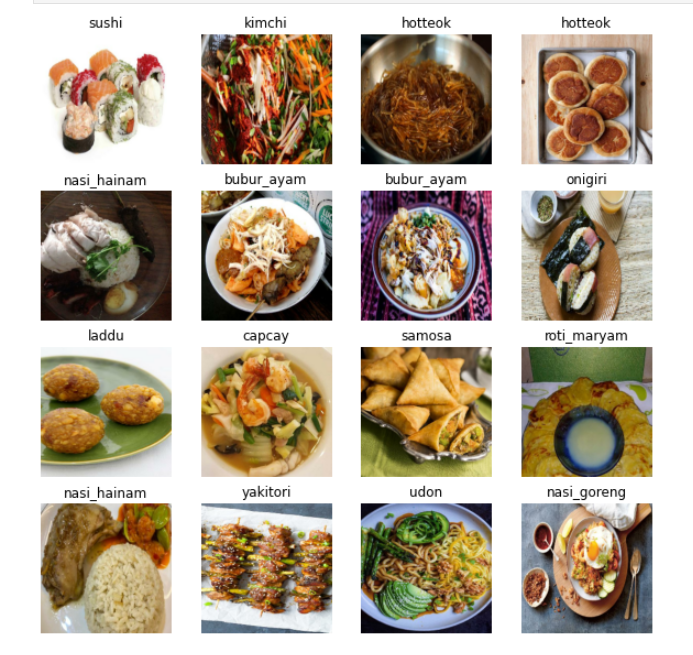
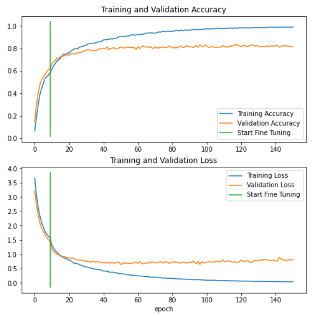

 

  <h2 align="center">Onigiri Restaurant Recommendation</h2>

  <h3 align="center">Food Recognition Model</h3>

## Built With

- [Tensorflow](https://www.tensorflow.org/)
- [Google Colab](https://colab.research.google.com/)

## Data Exploration & Preparation

We use Food Images dataset, food images collection from various countries including Indonesia, China, India, South Korea, Thailand, Japan. This dataset has ~200 images in each class.

This how our dataset looks like:

    

The dataset we use is obtained from scrapping process using <a href="https://pypi.org/project/bing-image-downloader/">bing-image-downloader</a>. The dataset we got from bing scrapping will be divided into train, validation, and test data.

You can see the detail of our scrapping dataset process <a href="https://github.com/Onigiri-Capstone/ml-model-training/tree/main/scrapping_food_images">here</a>.

## Technique Used

### Images Classification

We use TensorFlow API to do Transfer Learning on images clasification task for our custom food images dataset. We use <a href="https://www.tensorflow.org/api_docs/python/tf/keras/applications/mobilenet_v2/MobileNetV2">MobileNetV2</a> model as base model, do fine tuning, and add some output layers at the bottom of the pretrained model. MobileNetV2 model, which previously trained on `Imagenet` dataset, has some base of knowledge that will help us in classifying foods task. At the end, our model will produce food class predictions with the highest probability score.

After we trained the model on ~5000 images of Indonesian Restaurants' common foods, we got 81% validation accuracy.

This is our training result:

    

And this is our learning curve:

    

You can see the detail of our training process and dataset that we use <a href="https://github.com/Onigiri-Capstone/ml-model-training/tree/main/transfer_learning_with_mobilenet.ipynb">here</a>.

## Acknowledgements
