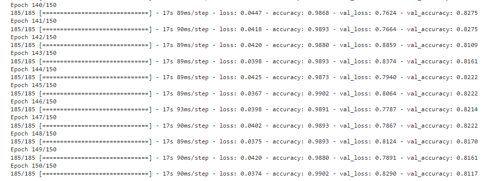

 

  <h2 align="center">Onigiri Food Recommendation</h2>

## Built With

- [Tensorflow](https://www.tensorflow.org/)
- [Google Colab](https://colab.research.google.com/)

## Data Exploration & Preparation

This notebook contains a classification of food data. Where for each jpg format data. The data we use is obtained through a scrapping process using bing scrapping. the data we get through bing scrapping will be divided into training data, validation data, and testing data.

You can see the detail of our scrapping dataset <a href="https://github.com/Onigiri-Capstone/ml-model-training/tree/main">here</a>.

## Technique Used

### Images Classification

We use TensorFlow API with MobileNet v2 model as base model for our foods recognizer. MobileNet v2 model which previously trained on our dataset try to produce object class predictions with highest similarity score.

This is our training result :

    

After we trained the model on ~5000 images of Indonesian Restaurant common foods, we got 81.7% validation accuracy.

You can see the detail of our training process and dataset that we use <a href="https://github.com/Onigiri-Capstone/ml-model-training/tree/main">here</a>.

## State of Arts or Journal

## Explanation For Workflow

## Acknowledgements

